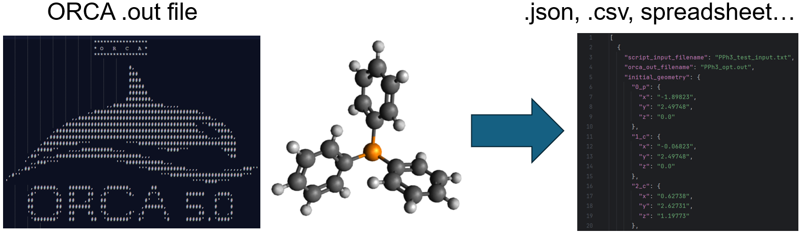

<h1 align="center">orca-data-extraction ⚛️</h1>

  
  
  

> Scripts related to searching for and extracting data from ORCA .out files into Excel spreadsheets, CSV files, etc.

### 🏠 [Homepage](https://github.com/pmwaddell/orca-data-extraction)

## Setup

Clone the repository from the [github page](https://github.com/pmwaddell/orca-data-extraction). Install the dependencies
in requirements.txt if needed (with pip, conda, etc.). Navigate to the src directory and run orca_out_to_csv, 
orca_out_to_excel, or orca_out_to_json depending on your desired output format. Add the src directory to your PATH to 
run these scripts from anywhere.

## Operation

First, run your desired calculations with [ORCA](https://www.kofo.mpg.de/en/research/services/orca) and obtain the 
resulting .out files. 

Next, prepare an input.txt file for this script, based on the example found in orca-data-extraction/orca_data_extraction/data. 
Specify the information you would like to extract from the ORCA .out file by providing the desired "atom labels" for 
each category of interest. The term "atom label" refers to ORCA's scheme of distinguishing each atom in the structure, 
which follow the pattern of "number element", for example: "19 C". These can be found in the ORCA .out file: for 
example under the section "CARTESIAN COORDINATES (A.U.)". The user should carefully examine this section to match the 
atom labels therein to the atoms of interest.

The categories of data are: initial geometry, final geometry, bond lengths, bond angles, Mulliken charges and charge 
sums, and Loewdin charges and charge sums. Initial geometry refers to the geometry input to ORCA by the user: for 
example, the starting geometry in a geometry optimization calculation. Final geometry is the geometry at the end of the 
calculation, or the final set of geometry data appearing in the .out file. For single point calculations, initial and 
final geometry should be the same. Bond lengths and bond angles are calculated based on the "final geometry" in the 
ORCA .out file. Note that any set of two or three atoms, respectively, can be specified for these sections: they do not 
have to be in a bonding relationship of any sort. Mulliken and Loewdin charges are based on the final geometry of the 
calculation as well. In addition, dipole moment, polarizability and HOMO LUMO energy data will also be provided in 
available in the calculation.

Then, run the script (orca_out_to_*.py) of your choice in the directory containing the .out files depending on the 
desired output: CSV, JSON or Excel. Provide the name of the input .txt file you prepared as well as the desired name 
of the output file. If successful, the script will produce the desired output file in the same directory.

## Author

👤 **Peter Waddell**

* Website: https://github.com/pmwaddell
* Github: [@pmwaddell](https://github.com/pmwaddell)
* LinkedIn: [@https:\/\/www.linkedin.com\/in\/peter-waddell-ph-d-00b95265\/](https://linkedin.com/in/https:\/\/www.linkedin.com\/in\/peter-waddell-ph-d-00b95265\/)

## Show your support

Give a ⭐️ if this project helped you!

## 📝 License

Copyright © 2024 [Peter Waddell](https://github.com/pmwaddell). 
This project is [MIT](https://www.mit.edu/~amini/LICENSE.md) licensed.
